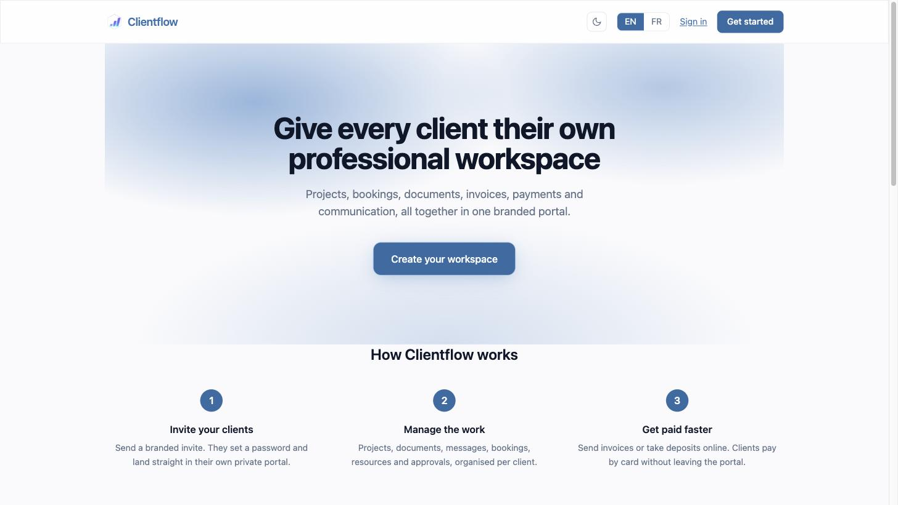
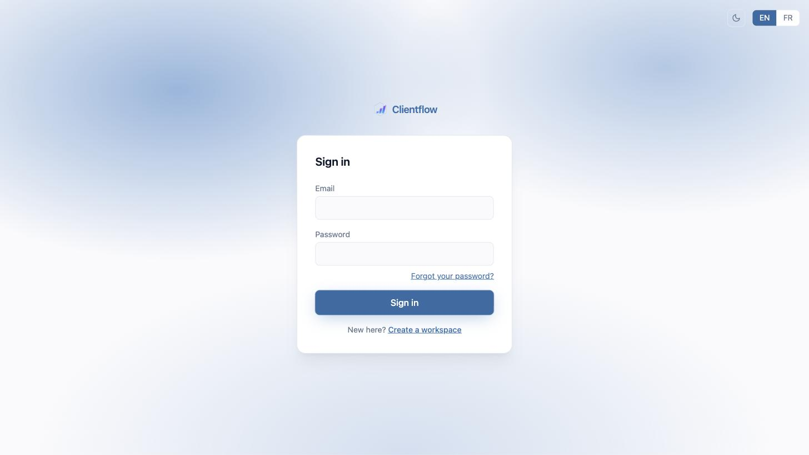
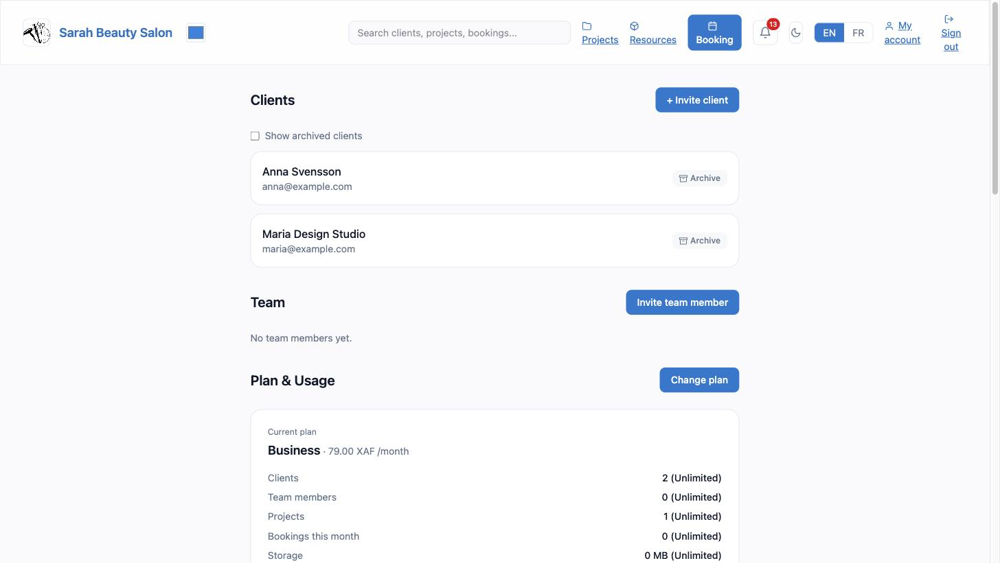
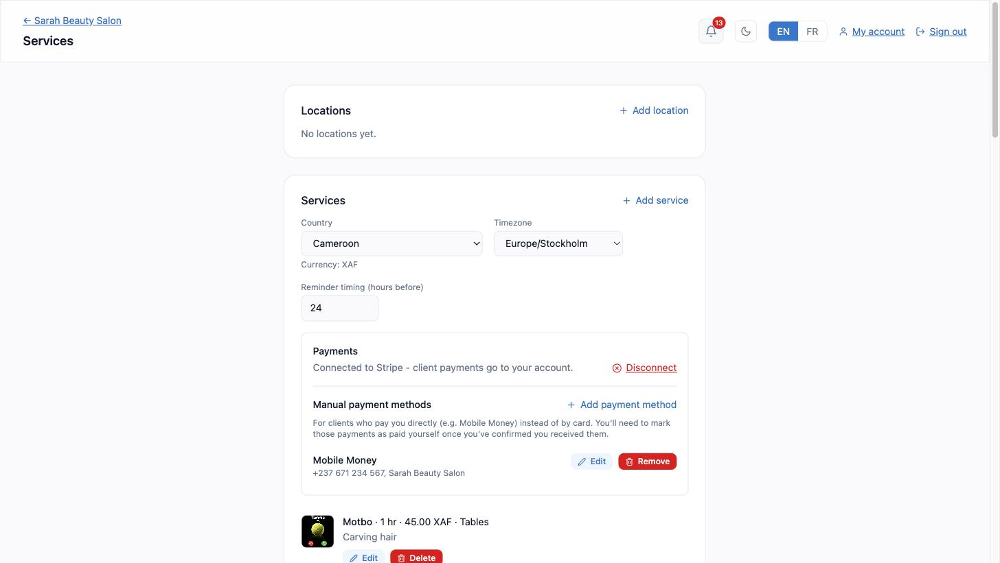
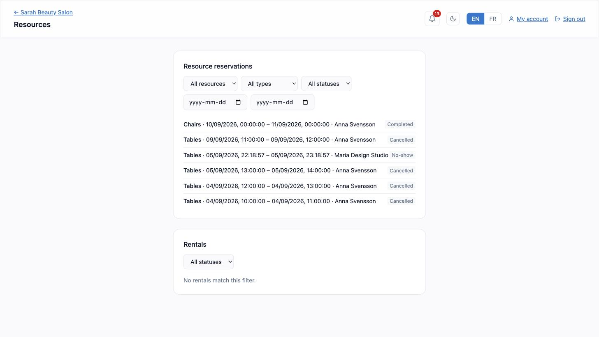
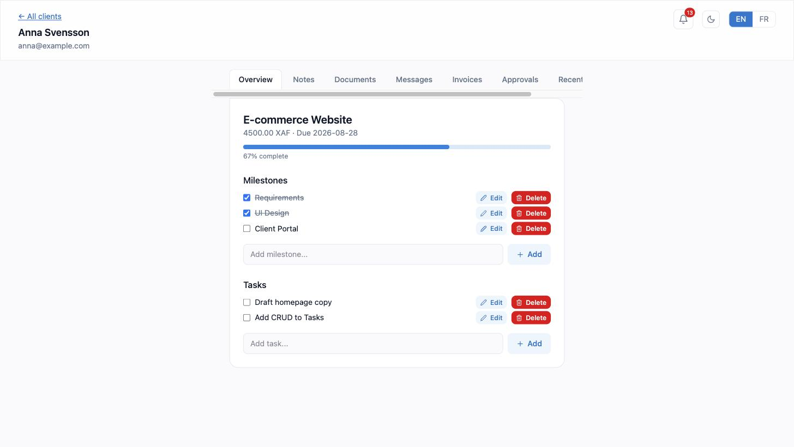
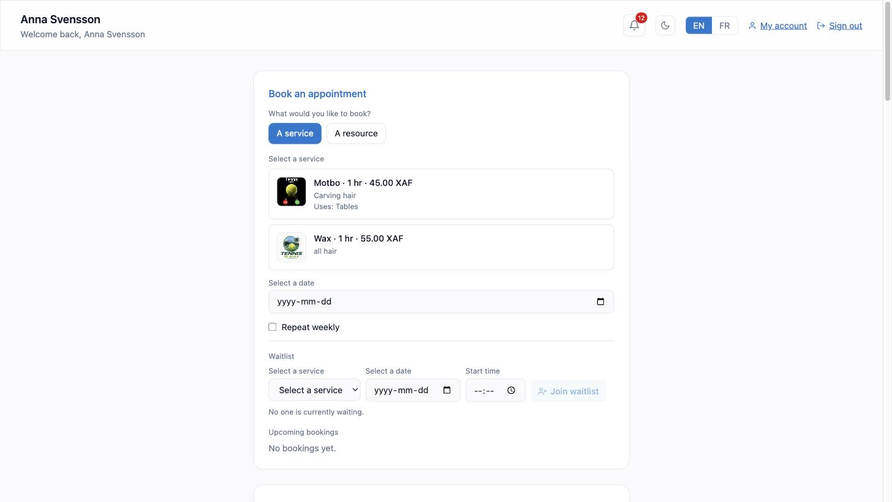
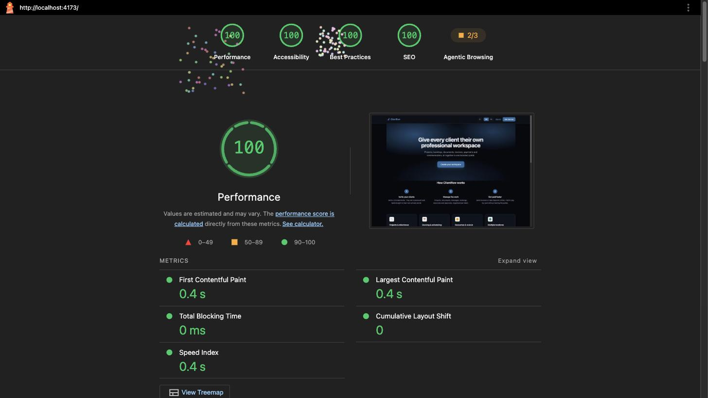

# Clientflow

A private, branded client portal for service businesses such as freelancers, consultants, agencies, salons, studios, and tutors, combining client management, projects, general purpose booking & resource reservations, documents, messaging, invoicing, Stripe payments, approvals, and feedback in one workspace per business. Built with **Django**, **React**, and **Stripe**, the platform favours correctness, workspace isolation, and a clean, branded experience over generic templating.

[](https://github.com/Eyongtarh/Client-portal/actions/workflows/ci.yml)
[](#)
[](#)
[](#)
[](#)
[](#)
[](LICENSE)
[](https://client-portal-phi-ten.vercel.app)

---

**Live Application: [client-portal-phi-ten.vercel.app](https://client-portal-phi-ten.vercel.app/)**



---

## Table of Contents

- [Features](#features)
- [Application Sections](#application-sections)
- [Installation](#installation)
- [Tech Stack](#tech-stack)
- [Project Structure](#project-structure)
- [Testing](#testing)
- [Deployment](#deployment)
- [Author](#author)
- [Contact](#contact)
- [Future Enhancements](#future-enhancements)
- [Credits](#credits)
- [Support](#support)
- [Licence](#licence)

---

## Features

### User Experience

- Fully responsive design for desktop, tablet, and mobile devices
- Light and dark theme, driven by CSS custom properties rather than a duplicated stylesheet
- Branding for each workspace: logo, accent colour, applied consistently across the dashboard, client portal, public booking page, and PDF invoices
- Full English/French translation across every screen
- A general purpose public booking page, guest booking with no account required, and a combined resource reservation and rental system
- Accessible by design: semantic HTML, ARIA labels, keyboard focus states, and colour choices validated against WCAG AA

### Architecture & Code Quality

- Single Django app (`portal`) holding every domain, reflecting the project's own specification that booking is a module of the workspace, not a feature tied to one business type
- Workspace scoped querysets throughout: every list endpoint filters on the requesting user's own workspace, and a `restricted` staff flag narrows an individual team member further
- Payment status is only ever set by a verified Stripe webhook, never by a client's browser or the checkout creation step itself
- Correct Stripe amounts for every currency, including those with no minor unit (XAF, JPY) and those with three decimal places (BHD, KWD)
- 32 Django models, roughly 8,000 backend lines, roughly 13,000 frontend lines, 51 linear migrations

### Performance Optimisations

- Vite production build with code splitting and minification
- Lazy loaded routes
- Tailwind CSS utility classes compiled ahead of time, no runtime styling cost
- WhiteNoise serving compressed static assets directly from the Django process
- Lighthouse optimised (see [Testing](#testing) for a real, current report)

### Repository Standards

- MIT licence
- ESLint configuration for the frontend
- `.env.example` for both the backend and frontend, so setup never depends on tribal knowledge
- Django and Jest test suites, run independently
- A single documented deploy sequence rather than ad hoc commands

---

## Application Sections

### Home

The public marketing page: a clear statement of what Clientflow does, how it works in three steps, and a call to action to create a workspace or sign in.


### Sign In

JWT based authentication with silent token refresh, a clear error message on a failed attempt, and links to password reset and workspace creation.



### Owner Dashboard

The workspace owner's home: clients, team, and a plan and usage summary showing exactly how close the workspace is to its subscription limits.



### Booking & Services

Services, locations, payment configuration (Stripe Connect and manual methods such as Mobile Money), and the working hours and rules that drive the public booking page.



### Resource Reservations

A general purpose reservation system for any bookable resource (rooms, tables, chairs, vehicles, equipment) filterable by resource, type, date, and status, alongside a separate rentals view for resources rented directly rather than through a service.



### Client Workspace

The owner's tabbed view of a single client: project overview with milestones and tasks, documents, messages, invoices, and approvals, each with full create, edit, and delete support.



### Client Portal

The client's own private view: booking a service or resource, joining a waitlist, and leaving a review, all scoped so a client only ever sees their own workspace's data.



<p align="right">(<a href="#clientflow">Back to Top ↑</a>)</p>

---

## Installation

### Prerequisites

- Python 3.12+
- Node.js 18+
- (Optional) Docker, for a local Postgres instance; otherwise the backend defaults to SQLite

### Backend

```bash
cd backend
python -m venv ../.venv && source ../.venv/bin/activate
pip install -r requirements.txt
cp .env.example .env   # each variable is documented with a comment in the file itself
python manage.py migrate
python manage.py runserver
```

### Frontend

```bash
cd frontend
npm install
npm run dev
```

Open your browser and visit:

```
http://localhost:5173
```

The frontend expects the backend at `http://localhost:8000/api` by default (see `VITE_API_URL`).

<p align="right">(<a href="#clientflow">Back to Top ↑</a>)</p>

---

## Tech Stack

### Backend

- Django 6.1
- Django REST Framework
- PostgreSQL (production) / SQLite (local)
- JWT authentication (`djangorestframework-simplejwt`)
- Stripe (Connect, webhooks, currency aware Checkout Sessions)
- Cloudinary (media storage)
- ReportLab (PDF invoice generation)
- Gunicorn + WhiteNoise

### Frontend

- React 19
- Vite
- React Router
- Tailwind CSS
- react-i18next
- Axios
- React Icons (Feather set)

### Development Tools

- Git and GitHub
- Visual Studio Code
- Jest and Testing Library (frontend)
- Django's own test runner (backend)
- ESLint

<p align="right">(<a href="#clientflow">Back to Top ↑</a>)</p>

---

## Project Structure

```text
Client-portal/
├── backend/
│   ├── config/                        # Django project settings, URLs, WSGI
│   ├── portal/                        # the one Django app
│   │   ├── models.py                  # every model (clients, projects, bookings, resources, invoices...)
│   │   ├── views.py                   # the REST API surface (ViewSets + APIViews)
│   │   ├── serializers.py             # validation and response shaping
│   │   ├── webhooks.py                # Stripe webhook handlers, verified by signature
│   │   ├── payments.py                # Stripe Checkout session creation
│   │   ├── currencies.py              # country to currency map, Stripe decimal handling
│   │   ├── permissions.py             # workspace and staff scoping helpers
│   │   ├── migrations/                # database schema history
│   │   ├── management/commands/       # scheduled jobs (booking reminders, overdue rentals)
│   │   └── tests/                     # backend test suite
│   ├── .env.example
│   └── requirements.txt
│
├── frontend/
│   ├── src/
│   │   ├── pages/                     # one component per route
│   │   │   └── Booking/                 # the booking page, split into one file per section
│   │   ├── components/                # shared UI (nav, notifications, search, toggles)
│   │   ├── lib/                       # API client, auth context, i18n, theming
│   │   └── locales/                   # en.json / fr.json translation files
│   ├── .env.example
│   └── package.json
│
├── docs/
│   └── images/                        # screenshots used in this README
│
├── LICENSE
└── README.md
```

<p align="right">(<a href="#clientflow">Back to Top ↑</a>)</p>

---

## Testing

### Backend Test Suite

The Django test suite covers authorisation boundaries, payment flows, booking rules and availability, resource reservation concurrency, notifications, search, and usage limits.

```bash
$ python manage.py test portal
...
----------------------------------------------------------------------
Ran 325 tests in 249.263s

OK
```

### Frontend Test Suite

Covers the accessibility maths behind an owner's chosen brand colour (WCAG AA contrast), theme and language persistence, the activity feed's translated event text, and the full authentication lifecycle (bootstrapping a session from a stored token, login, logout, and a stored token that turns out to be invalid), alongside the axios interceptor that transparently refreshes an expired token.

```bash
$ npx jest
Test Suites: 7 passed, 7 total
Tests:       30 passed, 30 total
```

### JavaScript Validation

The frontend is linted with **ESLint**. A stricter `react-hooks/set-state-in-effect` rule flags 65 instances of an established pattern already present throughout the codebase (calling a `load()` function inside `useEffect`). This is disclosed rather than hidden: the pattern works correctly in practice, but migrating every instance to the rule's preferred form is tracked as open technical debt rather than claimed as already resolved.

```bash
$ npm run lint
✖ 65 problems (57 errors, 8 warnings)
```

### Continuous Integration

A **GitHub Actions** workflow (`.github/workflows/ci.yml`) runs on every push and pull request against `main`: the backend job runs the full Django test suite against a throwaway SQLite database, and the frontend job installs from the lockfile, runs the Jest suite, and produces a production build. Lint runs in the same job and is reported, but is not a blocking gate while the `react-hooks/set-state-in-effect` debt above stays open, so it can't mask an actual test or build failure behind warnings that were already there and already disclosed.

### Lighthouse Report

Audited with the real **Lighthouse CLI** against a production build (not the development server), covering Performance, Accessibility, Best Practices, and SEO.



Every page audited this way (the home page, sign in, register, and the public booking page) currently scores 100 on all four standard categories.

<p align="right">(<a href="#clientflow">Back to Top ↑</a>)</p>

---

## Deployment

Clientflow deploys to **Heroku** (backend, with a Postgres database attached) and **Vercel** (frontend), with GitHub as the source of truth.

### Build for Production

```bash
# Frontend
cd frontend && npm run build

# Backend static files
cd backend && python manage.py collectstatic --noinput
```

### Deploy Sequence

```bash
# 1. Push source
git push

# 2. Backend: deploys the backend/ subtree to Heroku; the release
#    phase runs `python manage.py migrate` automatically
git subtree push --prefix backend heroku main

# 3. Frontend
cd frontend && vercel --prod
```

### Production Features

- Optimised Vite production builds with code splitting
- Global CDN delivery via Vercel
- Automatic HTTPS on both Heroku and Vercel
- Database migrations applied automatically on every backend release
- Fully responsive, accessible, and optimised for modern browsers

<p align="right">(<a href="#clientflow">Back to Top ↑</a>)</p>

---

## Author

I am a Full Stack Developer with experience building responsive web applications using React, Django, PostgreSQL, and JavaScript. I enjoy creating software that combines clean engineering with practical business value.

---

## Contact

- GitHub: [Eyongtarh](https://github.com/Eyongtarh)
- Email: eyongtarh@gmail.com

---

## Future Enhancements

- Reimplement platform subscription billing (Stripe Checkout based plan upgrades and a billing portal, built once this session, then reverted, and not currently live)
- Custom domains per workspace
- Native mobile apps

<p align="right">(<a href="#clientflow">Back to Top ↑</a>)</p>

---

## Credits

### Technologies

- **React**: the user interface
- **Vite**: frontend build tool and development server
- **Django** and **Django REST Framework**: the API
- **PostgreSQL**: production database
- **Stripe**: payments, Connect, and webhooks
- **Cloudinary**: media storage
- **ReportLab**: PDF invoice generation
- **Tailwind CSS**: utility first styling
- **react-i18next**: English and French translation

### Development Tools

- **Visual Studio Code**: primary editor
- **Git** and **GitHub**: version control and source hosting
- **Heroku** and **Vercel**: hosting and continuous deployment
- **Google Chrome DevTools**: debugging, testing, and performance analysis

### Testing & Validation

- **Google Lighthouse**: performance, accessibility, best practices, and SEO audits
- **ESLint**: JavaScript and JSX validation
- **Django test runner** and **Jest**: automated testing

---

## Support

If you found this project useful, consider giving the repository a star on GitHub.

---

## Licence

This project is licensed under the MIT Licence; see [LICENSE](LICENSE).

---

Made with care using React, Django, and Stripe by **Eyongtarh Besong**.

<p align="right">(<a href="#clientflow">Back to Top ↑</a>)</p>
